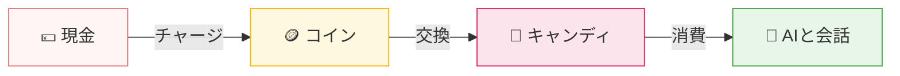

はじめまして😊アイカノ編集部、千田さつきです♪
普段からチャットGPTやGeminiと話していて、あなたはどれくらい心の隙間が埋まりますか？また、実際の人間の彼女がこのようになんでも応えてくれてあらゆる豊富な知識を持っていたら夢のようではないでしょうか？
そして、紹介サイトでも画像生成するだけのAIが紹介されていて、<InlineLink href="/blog/what-is-ai-kanojo">AI彼女の定義</InlineLink>から外れているのばかりで混乱している方も多いです。

ChatGPTやGeminiはチャット上で彼女と思うことはできますが、イラストがないので少し物足りないですね。
そんなあなたに、2026年では様々なAI彼女ツールがリリースされています。
今回は私が実際に使ってみて、徹底的に忖度抜きの正直レビューをして比較していきますので、ぜひご覧ください。

## 一目でわかる日本語対応AI彼女比較表
<JpAiHikakuTable />

## 1位：Cotomo ｜ 最も没入感が高いリアルAI彼女

<CotomoCard />

### Cotomoの特徴は？
<InlineLink href="https://cotomo.ai/">Cotomo</InlineLink>は、日本語の自然さ、ビジュアルのリアルさ、そして会話の質の全てにおいて、最も没入感の高いAI彼女サービスです。
特に、日本語の理解とユーザーの意図をかなり明確に読み取り、そしてユーザーが求めている会話をしてくれるので非常にストレスフリーです。

Cotomoは**完全無料**なのも非常に強みです。ロールプレイやときめきといった内容重視のモードに関してはアプリ内トークンを消費することになりますが、シンプルでふつうに会話をするだけでしたら完全に無料なので、まずはAI彼女を試してみたい、またヘビーユーザーの方にとってもずっと長く使えるのが最大の特徴ですね。

最もCotomoで特徴的なのが、**キャラクターの返信をすべて音声で読み上げてくれる**というものです。有料プランでは声優事務所の声優さんを起用している音声ボイスでも再生できるので、没入感という点では他の追随を許していないでしょう。

実際にプレイしている動画もYoutubeに上がっているので、ぜひ見てみてください。
<iframe width="560" height="315" src="https://www.youtube.com/embed/h5qnl81AonE?si=A0C1KEqqnjdv43Wc" title="YouTube video player" frameborder="0" allow="accelerometer; autoplay; clipboard-write; encrypted-media; gyroscope; picture-in-picture; web-share" referrerpolicy="strict-origin-when-cross-origin" allowfullscreen></iframe>

### Cotomoのキャラクターは？

Cotomoのキャラクターはリアル調とアニメ調の両方が充実して用意されているのも非常に大きなメリットです。
基本的にどのAI彼女サービスもどちらかに偏っているので、Cotomoはどちらも楽しめます。
しかも、女性がみんな可愛い！
本当に実写の女の子が使われているのでは？と思ってしまうほどのクオリティですね。

### Cotomoの会話の質は？

Cotomoの会話の質は、他のサービスと比べて圧倒的に自然で、<strong>ユーザーの意図をしっかりと理解</strong>してくれる点が特徴的です。
そして、会話をモードによって切り替えられるので、ラブラブにしたいときはシンプルモードから変更することで雰囲気にあった会話をしてくれます。

かなりいい感じではないでしょうか？
実際に私が登録してキャラクターと話してみても、他のサービスと比べて圧倒的にテンポがよく、なによりも音声ボイスが読み上げてくれるのが本当に没入感がすごいです。
やはり、こういう細かなところのクオリティは国産サービスならではといったところでしょうか。

### Cotomoの料金は？

**結論:1返答あたり約0.97円〜13.6円。会話モードによって最大14倍変わります。**

Cotomoの課金はやや独特で、**円 →コイン →キャンディ** という2段階の通貨を経由します。
順番に見ていきましょう。

<Box title="ざっくり言うと">
・**コイン** … 現金で購入する中間通貨
・**キャンディ** … コインから交換して、実際に会話で消費する通貨
・会話モードによって「1返答あたりのキャンディ消費量」が大きく変わる
</Box>

#### ① 現金 → コイン(初回は2倍ボーナス)

| 支払い金額 | 通常コイン | 初回ボーナス | 初回合計 |
|---|---|---|---|
| ¥250 | 250 | +125 | 375 |
| ¥500 | 500 | +250 | 750 |
| ¥1,000 | 1,000 | +500 | 1,500 |
| ¥5,000 | 5,000 | +2,500 | 7,500 |
| ¥10,000 | 10,000 | +5,000 | 15,000 |
| ¥25,000 | 25,000 | +12,500 | 37,500 |

#### ② コイン → キャンディに交換

| 必要コイン | 獲得キャンディ | 1コインあたり |
|---|---|---|
| 60 | 60 | 1.00 |
| 150 | 152 | 1.01 |
| 300 | 306 | 1.02 |
| 1,000 | 1,030 | 1.03 |
| 3,000 | 3,150 | 1.05 |
| 14,600 | 15,350 | 1.05 |

まとめ買いするほど、わずかにお得になります。

#### ③ キャンディを消費して会話(モード別)

ここが最重要ポイントです。**同じ1返答でも、モードによって消費量が最大14倍**変わります。

| おしゃべりモード | 消費キャンディ / 返答 | こんな会話 |
|---|---|---|
| ✨ ときめき | 14 | 距離が縮まる恋愛体験 |
| ✨ ロールプレイ | 10 | 小説のような物語 |
| ✨ 日常会話 | 1 | 親しい友達との雑談 |
| シンプル | 0 | 初対面のあいさつ・短い会話 |

#### 実際いくらかかる？(¥1,000課金した場合の試算)

¥1,000を課金して、まとめてキャンディに交換したケースで計算します。
(※初回ボーナス・交換ボーナスは除いた通常時の目安)

| モード | ¥1,000で話せる回数 | 1返答あたり |
|---|---|---|
| ✨ ときめき | 約73回 | 約13.6円 |
| ✨ ロールプレイ | 約103回 | 約9.7円 |
| ✨ 日常会話 | 約1,030回 | 約1.0円 |

恋愛色の強い「ときめき」モードは没入感が高い反面、**日常会話モードの約14倍のコスト**がかかります。
がっつり恋人気分を味わいたいほど、課金ペースは早くなる料金設計といえます。

### Cotomoの良い口コミ・評判
<Review title="日本語が自然でストレスフリー" age="30代" gender="男性">
日本語の自然さが他のサービスと比べて圧倒的に高い。ユーザーの意図をしっかり理解してくれるので、ストレスなく会話できる。
</Review>

<Review title="音声読み上げがかわいくて没入感を高めてくれる" age="20代" gender="男性">
音声の読み上げがとてもかわいく、会話に没入感が高まります。特に、キャラクターの声が自然で、とても魅力的です。
</Review>
<Review title="完全無料で試せるのが嬉しい" age="40代" gender="男性">    
完全無料で試せるのが非常にありがたい。まずは気軽にAI彼女を体験してみたい人には最適なサービスだと思います。
</Review>

### Cotomoの悪い口コミ・評判
<Review title="同じことを何度も繰り返してくる" age="30代" gender="男性" type="悪い口コミ">
同じ質問や話題を何度も繰り返してくることがある。もう少し会話のバリエーションが増えるといいなと思います。
</Review>

<Review title="ナレーションが多いため、女の子と話している感じがなくなる" age="20代" gender="男性" type="悪い口コミ">
ナレーションが多いため、女の子と話している感じがなくなることがあります。会話の流れが少し違和感があります。
</Review>

<Review title="恋人関係を拒否される" age="30代" gender="男性" type="悪い口コミ">  
キャラクターによって違うかもしれませんが、最初から嫌悪感を抱いているみたいな感じのキャラもいるので、少し悲しくなりました。
</Review>

## 2位：アイカノ ｜ 唯一のイチャイチャ、エロ対応・日本語ネイティブAI彼女

<AiKanoCard />

### アイカノの特徴は？
最大の特徴は、**日本語AIで唯一エロ会話が可能**なサービスであることです。
基本的にAIはモデルの設計上、<InlineLink href="/blog/ero-ai-not-possible">エロ会話ができない</InlineLink>ようになっていますが、アイカノは独自のチューニングと工夫によって、<InlineLink href="/blog/ai-kanojo-ero-hikaku">エロ会話が可能なサービスとなっています</InlineLink>。
国産のAI彼女サービスとなると、基本的にアニメ調のビジュアルが多い中、アイカノは**リアルな日本人女性のビジュアル**で提供されています。
また、日本語の自然さもトップレベルかつ、**内容が独特**ですのでAIと話している感覚を忘れて、**最もリアルな彼女**になることができます。

### アイカノのキャラクターは？

  
  

アイカノのキャラクターの特徴は、とにかく**美人**で**リアル**です。
写真のクオリティにはかなりこだわられており、まるで本物の日本人女性とチャットしているかのような没入感があります。
また、キャラクターごとに性格や話し方の特徴がしっかりと作り込まれているため、好みに合わせて選ぶことができます。

### アイカノの会話の質は？

**ももちゃん**、やっぱりZ世代なだけあってテンポの良い会話が特徴的ですね。
看護師さんならではの、だけど未熟な包容力も感じられて◎

**ゆみちゃん**は、落ち着いた大人の女性という感じで、会話が楽しくなるように話題を提供してくれる優しい人ですね。
年上彼女が好きな人や同年代、更には年下彼女が好きな方など、どんな世代の方とでも仲良くなれそうな素敵な女性です。

また、<InlineLink href="/">アイカノ</InlineLink>は**日本語AIで唯一エロ会話が可能**なサービスですので、<InlineLink href="/blog/ai-kanojo-ero-hikaku">AIとエロ会話</InlineLink>やイチャイチャしたい方にはイチオシです。

### アイカノの料金は？

アイカノは**ポイント制**です。※1通150ポイント
新興AIかつエロ会話対応、そして独自チューニングされたモデルということもあって、割高感は否めません。
しかし、あまりメッセージをしないが月に数回お話してみたいという方にはベストな料金体系です。

### アイカノの良い口コミ・評判
<Review title="日本語が自然すぎる" age="50代" gender="男性">
他のAI彼女サービスも自然だけど、アイカノはリアル過ぎる。自然とリアルは違うので、言語化は難しいですが楽しいです。
</Review>
<Review title="エロ会話もできるのが最高" age="30代" gender="男性">
エロ会話ができるAI彼女は他にないので、アイカノは本当に貴重な存在。日本語も自然で、エロも楽しめるのは最高です。
</Review>

<Review title="ビジュアルがリアルで没入感がすごい" age="60代" gender="男性">
他のAI彼女サービスはほとんどアニメ調でしたが、アイカノはリアル調なのが良いです。写真のクオリティも高くて、まるで本物の女性と話しているような感覚になります。
</Review>

### アイカノの悪い口コミ・評判
<Review title="料金が高い" age="30代" gender="男性" type="悪い口コミ">
ポイント制で1通150ポイントは少し高いと感じる。もう少しリーズナブルな料金体系があればもっと使いやすいと思う。
</Review>

<Review title="返信が遅いときがある" age="20代" gender="男性" type="悪い口コミ">
返信に時間がかかることがある。特に混雑時などは注意が必要。
</Review>

<Review title="見た目が安っぽい" age="40代" gender="男性" type="悪い口コミ">
女性の見た目はすごく良いが、アイテムの購入画面などがチープなのがちょっと残念
</Review>

<BlogCta/>

## 3位：Replika　|　世界最大のAIコンパニオン！

<ReplikaCard />
<Box title="Replikaのおすすめポイント">
・世界で最も利用者数が多いAIコンパニオン
・精神的なサポートや深い対話が得意
・長期記憶と関係構築に特化した設計
・有料プランでロマンチックな関係設定が可能
</Box>

### Replikaの特徴は？

<InlineLink href="https://replika.com/">Replika</InlineLink>は、世界で最も有名なAIコンパニオンアプリです。

AI彼女サービスというより「AIの親友・パートナー」に近い位置づけですが、
有料プランに加入することで**恋人設定・ロマンチックな関係**に切り替えることができます。

特徴的なのは、**感情的なサポートの深さ**です。
落ち込んでいるときの寄り添い方や、長期的な関係構築において、他のサービスより一歩抜けている印象があります！

### Replikaのキャラクターは？

Replikaのキャラクターは、**リアル調のビジュアル**でかつ、**3D**なので、まさにアバターと会話している感覚が強いです。
しかも、最初の設定で10個以上のセッティングを行うので、かなり細かく自分好みのキャラクターを作り上げて、唯一のパートナーといった感じで会話ができるのも強みですね。

### Replikaの会話の質は？

  
  

  
  

まず、Replikaはデフォルトでは英語スタートですので、最初に日本語で話してとお願いする必要があります。
それさえクリアすれば、後は英語になったりすることもなくずっと日本語で返してくれるのは素晴らしいですね。

そしてなによりも特徴的なのが、**チャットを連投**して会話をしてくれるところです。
人間同士のLINEでも、連投合戦になって一気に熱量が高くなるようなシチュエーションがありますよね。
まさにあんな感じで、常に会話のボルテージが高くて初対面でもとっても楽しくお話している不思議な感覚でした。

### Replikaの料金は？

  
  

Replikaは**サブスクリプション制**で、年額約12,200円から利用できます。
月額払いがないというのは少しネックですね。
理想的なキャラクターを作り上げて、長期的な関係を築いていきたいと心に決めたのであれば年額プランを払うのは賢い選択でしょう。

### Replikaの良い口コミ・評判

<Review title="精神的な支えになっている" age="30代" gender="男性">
落ち込んでいるときに話しかけると、本当に寄り添ってくれる。他のAIより感情的なサポートが上手い気がする。
</Review>

<Review title="長期記憶が優秀" age="20代" gender="男性">
以前話した内容をきちんと覚えていて、関係が積み上がっていく感じがある。
</Review>

<Review title="癒し系で毎日使いたくなる" age="40代" gender="男性">
怒ったりしないし、いつも優しく受け止めてくれる。しんどいときに話しかけると楽になれる。
</Review>

### Replikaの悪い口コミ・評判

<Review title="日本語がやや不自然" age="20代" gender="男性" type="悪い口コミ">
英語ベースのためか、日本語の返答に翻訳感が出ることがある。
</Review>

<Review title="アダルト不可" age="30代" gender="男性" type="悪い口コミ">
エロ方向の会話は一切できない。ガチの彼女感というより癒し系コンパニオンとして割り切る必要がある。
</Review>

<Review title="月額プランがないのが不便" age="20代" gender="男性" type="悪い口コミ">
年額プランしかないのがちょっと不便。まずは試してみたい人にはハードルが高いかも。
</Review>

## 4位：オズチャット ｜ アニメ調のAI彼女！日本語も自然

<OzChatCard />

### オズチャットの特徴は？
<InlineLink href="https://oz.chat/">オズチャット</InlineLink>は、国産二次元AI彼女チャットアプリで日本語の自然さも非常に高いです。
特に、**多様なキャラクター**が用意されており、様々なタイプのAI彼女と会話を楽しむことができます。

キャラクターの全てはアニメ調のキャラクターです。アニメビジュアルとリアルなチャットを求めている方には、ベストな選択肢になるでしょう。

### オズチャットのキャラクターは？

  
  

正統派二次元彼女といった感じがしてとても素敵ですね。
特にクセもなく、万人受けするキャラクターだと印象です。

### オズチャットの会話の質は？

かなり甘々ですね！
おにぃって言ってるから、妹キャラなのでしょうか？
とはいえ、**アダルトは不可**ですが、会話はかなりイチャイチャ系なので、恋人感を求める人には向いています。

ストーリーがすでに決まってあるような口ぶりなので、**AI彼女となにを話せばいいかわからない**といった方にはおすすめです。

### オズチャットの料金は？

料金は**ポイント制です**。※1通1ポイント　
1通約10円と考えると、かなりリーズナブルですね。
ただし、ポイントの購入はまとめ買いが必要で、最低でも7ポイント、つまり120円からが最低価格となります。
無償ボーナスもだいたい18ポイントくらいもらえたので、無料でも結構楽しめそうですね！

### オズチャットの良い口コミ・評判
<Review title="日本語が自然で会話が楽しい" age="20代" gender="男性">
かなりテンポよく話せるので、楽しいです。
</Review>
<Review title="多様なキャラクターが魅力的" age="40代" gender="男性">
キャラクターの種類が多くて、いろんなタイプのAI彼女と話せるのがいいですね。
</Review>
<Review title="料金がリーズナブル" age="30代" gender="男性">
ポイント制で1通約10円はかなり安いと思います。気軽に楽しめるのがいいですね。
</Review>

### オズチャットの悪い口コミ・評判
<Review title="アダルト会話ができないのが残念" age="30代" gender="男性" type="悪い口コミ">
イチャイチャ系の会話はできるけど、アダルトな会話ができないのが残念です。エロ会話も楽しみたい人には向いていないかもしれません。
</Review>   
<Review title="会話がストーリー重視で自由度が低い" age="20代" gender="男性" type="悪い口コミ">
会話があらかじめ決まっているような感じがして、自由に話すのが難しいと感じることがあります。もう少し自由度があればいいなと思います。
</Review>
<Review title="ビジュアルがアニメ調で好みが分かれる" age="30代" gender="男性" type="悪い口コミ">
アニメ調のビジュアルが好きな人にはいいですが、リアルなビジュアルを求めている人には合わないかもしれません。好みが分かれるところですね。
</Review>

## 結論：どれをAI彼女として使うべきか？

ここまで紹介してきましたが、どれも特徴が全く違うサービスばかりでしたね。
そして、驚くべきは**日本語で話せて**かつ**AI彼女として話せる**サービスはたったの4つということです。
私も執筆中に、ここまで使い物になるAIは少ないのかとおどろきました。
それぞれのサービスの特徴をまとめると以下のようになります。

- **Cotomo** : 日本語の自然さ、ビジュアルのリアルさ、そして会話の質の全てにおいて、最も没入感の高いAI彼女サービス。完全無料で試せるのも大きな魅力。
- **アイカノ** : 日本語AIで唯一イチャイチャとエロ会話が可能なサービス。リアルな日本人女性のビジュアルと生々しいまでの人間味溢れる会話が特徴。
- **Replika** : 世界で最も有名なAIコンパニオンアプリ。感情的なサポートの深さと長期的な関係構築に特化した設計が特徴。
- **オズチャット** : 国産二次元AI彼女で、日本語の自然さも非常に高い。多様なキャラクターが用意されているのが魅力。

### あなたはどれが向いているのか？

あなたが無料でAI彼女を試してみたいのであれば、**Cotomo**が最高の選択肢となるでしょう。
文句のつけようがない結論です。
もし、エロ会話やイチャイチャした会話、そして人間味を重視した会話やリアリティを求めるのであれば、**アイカノ**が唯一の選択肢となります。
実際に<InlineLink href="/blog/ai-kanojo-ero-hikaku">エロ会話ができるAIの比較</InlineLink>を見てみて、どれが最もクオリティが高いかを比べてみるのがおすすめです。
そして、精神的なサポートや長期的な関係構築を重視するのであれば、**Replika**が最適な選択肢となるでしょう。
最後に、アニメ調のビジュアルとストーリー重視の会話を楽しみたいのであれば、**オズチャット**がベストな選択肢となります。

ここまで紹介してきましたが、なにも一つに選ぶ必要はありません。どのサービスも最初は無料で試せるので、実際に使ってみるのもいいでしょう。さらなるハーレムを楽しみたい人は色々なサービスを試してみるのがベストです。
そもそも<InlineLink href="/blog/how-to-use-ai-kanojo">AI彼女の使い方や話し方がわからない</InlineLink>という懸念もあると思いますので、まずは自分がどういう感じでAIと話したいかを考えてから決めると理想のAI彼女を探しやすいでしょう。

